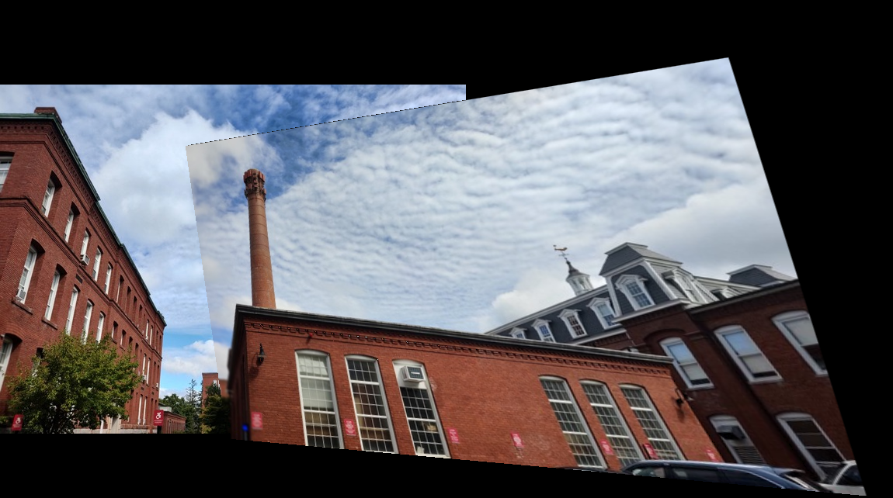

# AutoPano - Panorama Stitcher
- Stitches two or more images to create a seamless panorama image using classical &amp; deep learning approaches. 
- This is part of the course [RBE549:Classical and deep learning approaches to computer vision](https://nitinjsanket.github.io/teaching/rbe549/fall2022.html)

<!--
<table>
  <tr>
    <td>First Screen Page</td>
     <td>Holiday Mention</td>
     <td>Present day in purple and selected day in pink</td>
  </tr>
  <tr>
    <td valign="top"></td>
    <td valign="top"></td>
    <td valign="top"></td>
  </tr>
 </table>
-->

# Results 

### Custom Set
Following are the images we took at WPI

  
   

Output

## Design Overview

### Recognizing the panorama
We did a brute force feature matching with all possible pairs and recognised the best possible way to stitch images, aka recognizing panorama, using graph based approach outlined below

## Collaborators 
Sairaam Venkataramani
